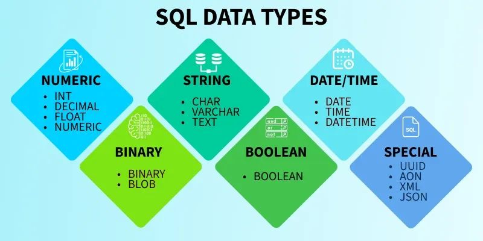

# Proyecto / Laboratorio: Gramática SQL simplificada con JFlex y CUP

## 📌 Objetivo general

Diseñar e implementar una gramática que permita reconocer y validar instrucciones básicas de un lenguaje SQL simplificado. El proyecto deberá integrar:

   - Un analizador léxico en JFlex.
   - Un analizador sintáctico en CUP.
   - Una clase principal en Java para ejecutar y probar el análisis.

## 🧩 Descripción del problema

Se desea construir un analizador que permita reconocer y validar instrucciones SQL simplificadas relacionadas con:

   - CREATE TABLE
   - SELECT
   - UPDATE
   - INSERT

El sistema deberá leer una o varias instrucciones de entrada y determinar si la sintaxis es válida según la gramática definida.

## 🛠 Instrucciones que debe reconocer la gramática
### 1. CREATE TABLE

La gramática deberá permitir sentencias como:


    create table estudiante (
        edad int,
        nombre varchar(50),
        fecha_nacimiento datetime,
        score decimal(18,2)
    );

Debe reconocer:

   - Nombre de tabla
   - Lista de columnas
   - Tipos de datos:
       * int
       * varcharNo
       * datetime
       * decimal(p,s)

### 2. SELECT

La gramática deberá reconocer sentencias como:

    select conteo(*) from tb_estudiante;
    select * from tabla1 a join tabla2 b on (b.id = a.id);


Debe reconocer:

   - Selección de *
   - Lista de campos
   - Función conteo(*)
   - Cláusula from
   - Alias de tablas
   - Cláusula join ... on (...)

### 3. UPDATE

La gramática deberá reconocer sentencias como:

    update tabla1 set campo = '123' where condicion = 123;


Debe reconocer:

   - Nombre de tabla
   - Cláusula set
   - Asignaciones
   - Cláusula opcional where

### 4. INSERT INTO ... VALUES

La gramática deberá reconocer sentencias como:

    insert into tabla1(campo1, campo2) values (123, 'Juan');


Debe reconocer:

   - Nombre de tabla
   - Lista opcional de columnas
   - Lista de valores

### 5. INSERT INTO ... SELECT

La gramática deberá reconocer sentencias como:

    insert into tabla1 select * from tabla2;
    insert into tabla1(campo1, campo2)
    select a.campo1, a.campo2
    from tabla2 a join tabla3 b on (b.id = a.id);

Debe reconocer:

   - Nombre de tabla
   - Lista opcional de columnas
   - Una consulta select como fuente de datos

## ⚙ Requerimientos técnicos

### 1. Analizador léxico en JFlex

El archivo léxico deberá reconocer, como mínimo, los siguientes elementos:

   - Palabras reservadas:
       * <span style="color:red"> create, table, select, from, where </span>
       * <span style="color:red"> update, set, insert, into, values </span>
       * <span style="color:red"> join, on, as </span>
       * <span style="color:red"> int, varchar, datetime, decimal </span>
   - Identificadores
   - Números
   - Cadenas de texto
   - Símbolos especiales:
     * <span style="color:red"> (, ), ,, ; </span>
     * <span style="color:red"> ., *, = </span>

### 2. Analizador sintáctico en CUP

El archivo de CUP deberá definir la gramática necesaria para validar las sentencias descritas en este enunciado.

La gramática deberá contemplar al menos:

   - Símbolo inicial
   - Lista de sentencias
   - Reglas para CREATE TABLE
   - Reglas para SELECT
   - Reglas para UPDATE
   - Reglas para INSERT
   - Condiciones simples en cláusulas ON y WHERE

### 3. Programa principal en Java

Se deberá implementar una clase principal que:

   - Lea una entrada de texto
   - Invoque el analizador léxico y sintáctico
   - Muestre si la sentencia es válida o no
   - Reporte errores léxicos o sintácticos cuando existan

## 📏 Reglas mínimas del lenguaje

   - Cada sentencia debe finalizar con ;
   - Se pueden procesar múltiples sentencias en un mismo archivo de entrada
   - Los identificadores representan nombres de tablas, columnas o alias
   - Las condiciones podrán manejar, como mínimo, expresiones del tipo:
        *  <span style="color:red">campo = valor</span>
        *  <span style="color:red">tabla1.campo = tabla2.campo</span>
   - Los valores podrán ser:
       * Números
       * Cadenas
       * Referencias a campos


✅ Ejemplos de entrada válidos

    create table estudiante (
    edad int,
    nombre varchar(50),
    fecha_nacimiento datetime,
    score decimal(18,2)
    );

    select conteo(*) from tb_estudiante;
    
    select * from tabla1 a join tabla2 b on (b.id = a.id);
    
    update tabla1 set campo = '123' where condicion = 123;
    
    insert into tabla1(campo1, campo2) values (123, 'Juan');
    
    insert into tabla1 select * from tabla2;
    
    insert into tabla1(campo1, campo2) select a.campo1, a.campo2 from tabla2 a join tabla3 b on (b.id = a.id);

## ⚠ Consideraciones importantes

   - No se evaluará la ejecución real de SQL sobre una base de datos.
   - El proyecto únicamente debe validar la estructura léxica y sintáctica.
   - No es necesario implementar semántica avanzada.
   - Se recomienda mantener la gramática organizada y modular.
   - Se valorará el manejo adecuado de errores.



## 📌 Validación de 1ra. Fase del Proyecto

En esta actividad se realizará la validación de la primera fase del proyecto, con el objetivo de comprobar el correcto funcionamiento del analizador léxico y sintáctico desarrollado.
# 🧩 Instrucciones

En esta actividad se evaluará la capacidad del sistema para procesar archivos de entrada válidos e inválidos.

El sistema debe permitir la carga y análisis de dos archivos distintos:

1. Archivo sin errores:
    Debe demostrar que el sistema es capaz de procesar correctamente todas las sentencias sin generar errores.
    Se debe incluir evidencia de la ejecución completa del archivo.


2. Archivo con errores:
    Debe demostrar que el sistema detecta correctamente errores léxicos y sintácticos.
    Se debe incluir evidencia de los errores generados por el sistema.

# ⚙ Requerimientos técnicos

- El sistema debe permitir cargar archivos de entrada.
- Debe mostrar claramente si las sentencias son válidas o contienen errores.
- Debe identificar errores léxicos y sintácticos de forma diferenciada.
- Los mensajes de error deben ser claros y comprensibles.


## Comandos para usar
- Para compilar el proyecto:
    ```bash
    mvn jflex:generate
    mvn cup:generate
    mvn clean verify
    ```
- Para eliminar los archivos generados por JFlex y CUP dentro de target:
    ```bash
    mvn clean
    ```